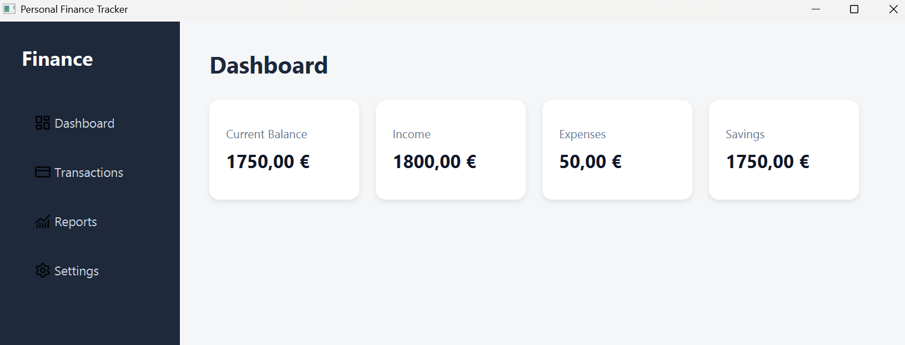
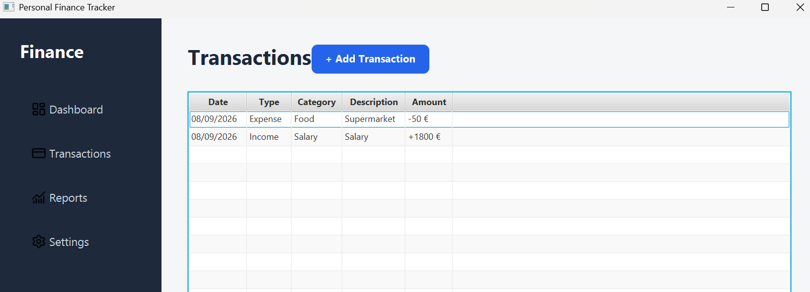

# Personal Finance Tracker

A desktop personal finance application built with Java and JavaFX.

The application allows users to record income and expenses, view their transaction history, and automatically track their current balance and financial summary.

Transaction data is stored locally using SQLite, allowing it to persist between application sessions.

## Features

- Add income and expense transactions
- Categorize transactions
- View transaction history
- Automatic balance calculation
- Income and expense summaries
- Input validation
- Local data persistence with SQLite
- Simple dashboard interface
- Sidebar navigation

## Technologies

- Java 21
- JavaFX
- CSS
- Maven
- SQLite
- JDBC
- Git

## Architecture

The application follows a simple layered structure:

```text
JavaFX UI
    ↓
Views
    ↓
TransactionService
    ↓
TransactionRepository
    ↓
JDBC
    ↓
SQLite
```

The project separates responsibilities between the user interface, business logic, and data persistence layers.

```text
com.josep.finance
│
├── FinanceApplication.java
│
├── model
│   └── Transaction.java
│
├── repository
│   └── TransactionRepository.java
│
├── service
│   └── TransactionService.java
│
└── view
    ├── DashboardView.java
    └── TransactionsView.java
```

## Dashboard

The dashboard automatically calculates:

- Current balance
- Total income
- Total expenses
- Savings

These values are calculated from the transactions stored by the application rather than being hardcoded.

## Transaction Management

Users can create transactions by specifying:

- Type (Income or Expense)
- Amount
- Category
- Description
- Date

Transactions are displayed in a JavaFX `TableView` and become immediately available to the dashboard calculations.

Monetary values are represented using `BigDecimal` to avoid floating-point precision issues.

## Data Persistence

Transactions are stored locally in an SQLite database.

The application automatically creates the database and required table when it is started for the first time.

Database operations are handled through JDBC using prepared statements.

The generated database file is excluded from version control.

## Running the Application

### Requirements

- Java 21
- Maven

Clone the repository:

```bash
git clone https://github.com/josepserravilar-boop/personal-finance-tracker
cd personal-finance-tracker
```

Run the application with Maven:

```bash
mvn javafx:run
```

The SQLite database will be created automatically when the application starts.

## Future Improvements

Possible future improvements include:

- Transaction editing and deletion
- Reports and charts
- Transaction filtering
- Additional categories
- Monthly budgets
- Automated tests
- Improved UI customization

## Screenshots

### Dashboard



### Transactions



## Author

Josep Serra

